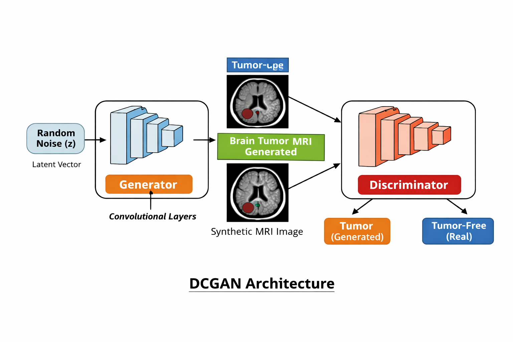

# GAN FOR IMAGES - Global Challenge
# Brain Tumour MRI Image Generation using DCGAN
## Project Team [Section 55 Group-1]

**Team Members:** B.Likitha, MD Lathif, Navadeep, Sameer, Hari Priya, Sruthika  

---
##  Overview
This project implements a Deep Convolutional Generative Adversarial Network (DCGAN) to generate synthetic brain MRI images for data augmentation and improved medical AI performance.

---

##  Objective
To design and implement a DCGAN model that generates realistic brain MRI images and enhances dataset size for better tumor detection models.

---

##  Purpose
Medical datasets are limited due to privacy and cost. This project generates synthetic MRI images to:
- Increase dataset size  
- Improve model accuracy  
- Reduce overfitting  

---

##  Dataset Description
Dataset contains brain MRI images with two classes:
- Tumor (Positive)  
- Normal (Negative)  

---

## 🧠 Architecture Diagram

<p align="center">
  
</p>

### Explanation
- **Generator** → Converts random noise into synthetic MRI images  
- **Discriminator** → Distinguishes real vs fake images  
- Both models compete and improve over time  

---

##  Data Preprocessing
- Resize → 64×64  
- Grayscale conversion  
- Normalization → [-1, 1]  
- Loaded using PyTorch DataLoader  

---

##  Innovation
- Upgraded from basic GAN → **DCGAN**
- Used convolution layers for better feature extraction  
- Improved image quality and realism  

---
## 📁 Project Structure

```
Global-Challenge/
│
├── src/
│   ├── train.py
│   ├── evaluation_pipeline.py
│   ├── model.py
│   ├── generator.py
│   └── data.py
│
├── models/
├── generated_images/
├── output_graphs/
├── Deliverables/
├── Brain_Tumor_Dataset/
├── requirements.txt
└── README.md
```

## Model Evaluation

### 🔹 Loss Curve
Shows Generator & Discriminator learning over epochs.

### 🔹 Confusion Matrix
Shows classification performance:
- High tumor detection accuracy  
- Slight bias toward tumor class  

---

##  Applications
- Medical data augmentation  
- Tumor detection systems  
- AI healthcare research  

---

## Conclusion
This project successfully demonstrates the use of Deep Convolutional GAN (DCGAN) for generating synthetic brain MRI images. The model learned important structural patterns and produced visually meaningful outputs.
Compared to a basic GAN, the DCGAN significantly improved image quality and realism. Although the generated images are not perfectly identical to real scans, they are useful for data augmentation and improving machine learning models.
Overall, this project highlights the effectiveness of GANs in solving data scarcity problems in the medical domain.

---
