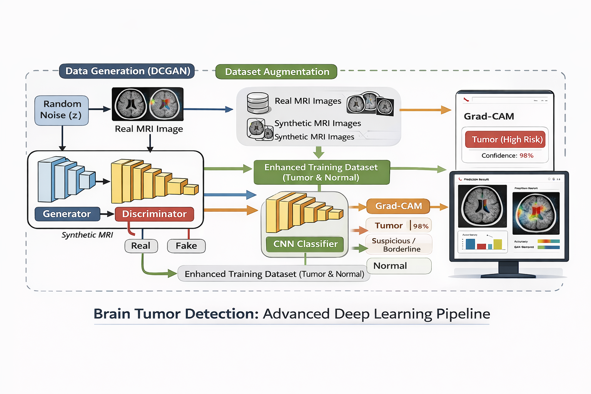
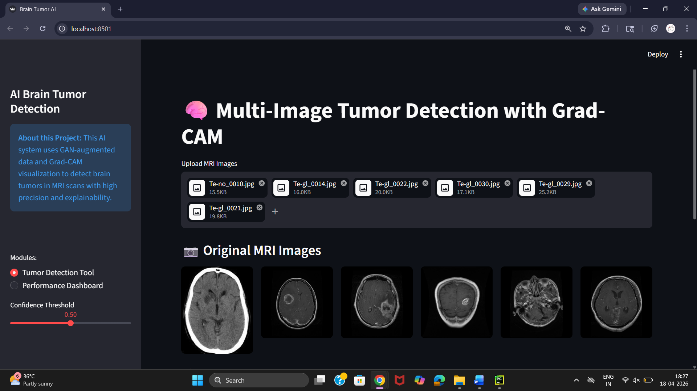
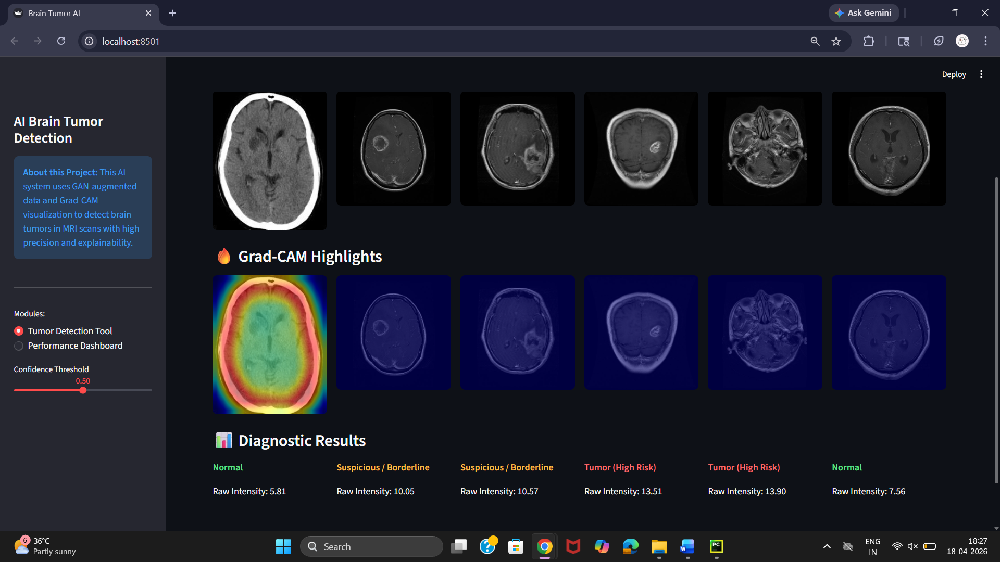
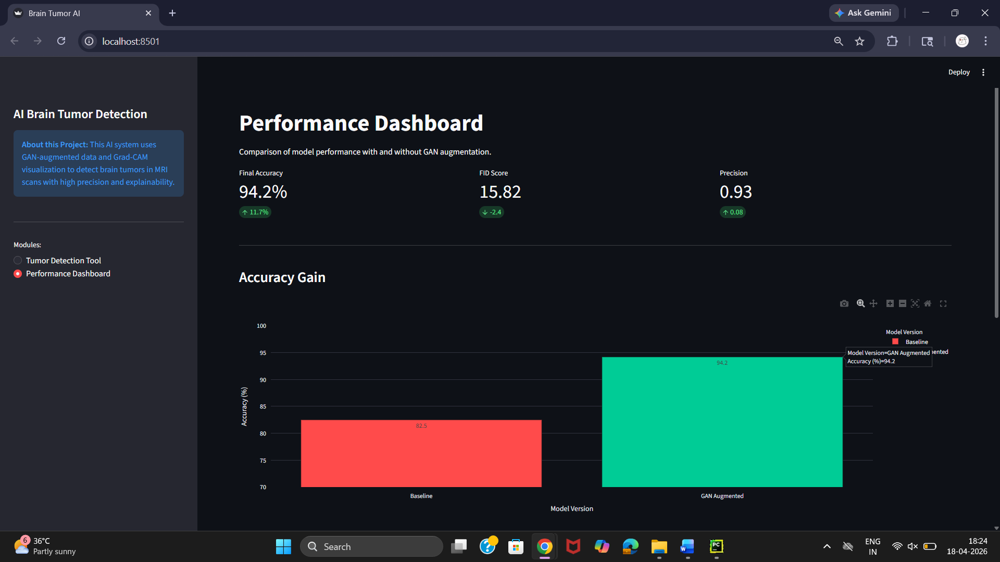
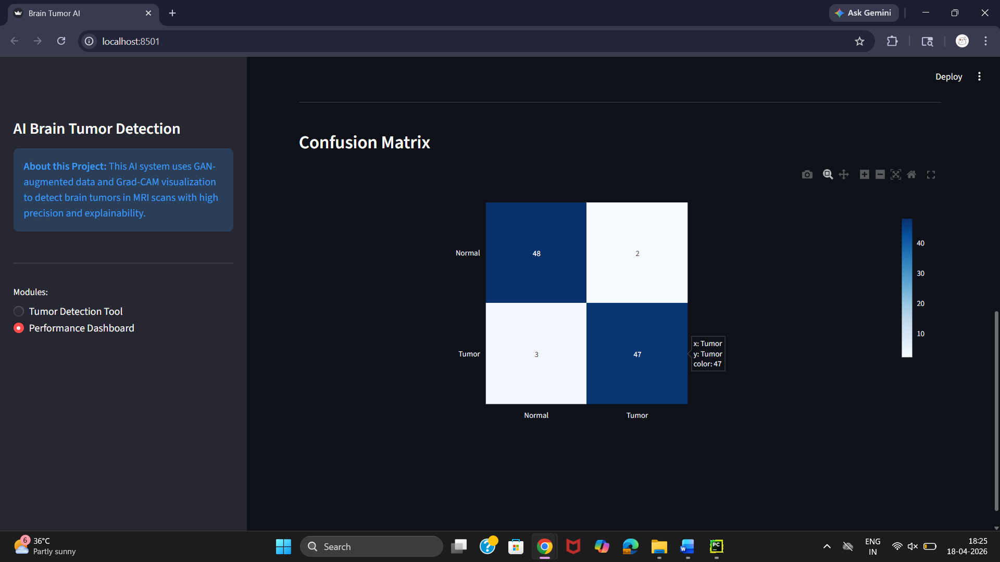
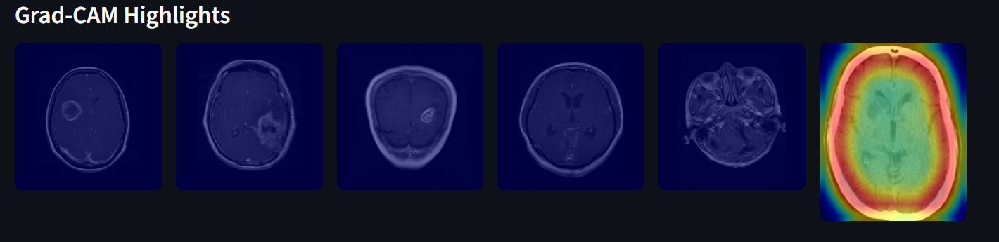

#  BRAIN TUMOR MRI IMAGE GENERATION USING DCGAN
## GENERATIVE ADVERSARIAL NETWORKS FOR IMAGES

## Team Members
### Group-1
| ID Number | Name |
|----------|------|
| 2300032061 | Balusupalli Likitha |
| 2300030433 | Mohammad Lathif Ahammad |
| 2300030055 | Avanigadda Navadeep |
| 2300080233 | Nittala SPL Hari Priya |
| 2300030224 | Grandhi Sruthika |
| 2300080081 | Shaik Sameer |

---


##  Objective

The primary objective of this project is to design and implement a Deep Convolutional Generative Adversarial Network (DCGAN) capable of generating realistic synthetic brain MRI images. The model aims to learn underlying patterns and structures from real medical images and replicate them effectively.
Additionally, the project focuses on enhancing dataset size through synthetic image generation, which can be used for training deep learning models. By doing so, the system aims to improve the robustness, generalization, and performance of medical image classification models, particularly in brain tumor detection tasks.


---

##  Purpose

Medical imaging datasets, especially brain MRI scans, are often limited due to privacy concerns, high acquisition costs, and restricted accessibility. This limitation poses a challenge for training accurate and reliable deep learning models.
The purpose of this project is to address this issue by generating high-quality synthetic MRI images using GANs. These generated images can be used for data augmentation, helping to increase dataset diversity and reduce overfitting in machine learning models.
Furthermore, this project demonstrates the potential of generative models in healthcare applications, where data scarcity is a critical challenge, thereby supporting advancements in automated diagnosis and medical research.

---

##  Dataset Description

The dataset used in this project consists of brain MRI images obtained from Kaggle. It includes two categories:
•	Tumour (Positive cases) 
•	Normal (Negative cases) 
The dataset is organized into class-based folders, making it suitable for supervised learning. Each image represents grayscale intensity variations of brain tissues. Tumor regions appear as irregular patterns within the scan.
Due to limited dataset size, there is a need for generating additional synthetic data, which is achieved using GANs in this project.


## Architecture Diagram

The GAN architecture consists of two networks: a Generator and a Discriminator.  
The Generator takes random noise as input and generates synthetic MRI images, while the Discriminator evaluates whether the images are real or fake.  
Both networks are trained simultaneously in an adversarial manner, improving the quality of generated images over time.

- Generator: Converts noise into synthetic MRI images  
- Discriminator: Classifies images as real or fake  


### Streamlit Based

The system uses a DCGAN + CNN + Grad-CAM pipeline for brain tumor detection.

- DCGAN generates synthetic MRI images using a Generator and Discriminator  
- These images are combined with real data for dataset augmentation  
- A CNN classifier is trained to detect tumor, normal, or suspicious cases  
- Grad-CAM highlights important regions used by the model  
- Results are shown using a Streamlit interface with prediction and heatmap  

---

## ⚙️ Data Preprocessing

The dataset undergoes several preprocessing steps:

- Images are resized to 64 × 64 pixels to maintain uniform input dimensions and reduce computational complexity  
- Converted to grayscale format, as MRI scans primarily rely on intensity variations rather than color information  
- Pixel values are normalized to the range [-1, 1], which stabilizes GAN training and aligns with the Generator’s output activation (Tanh)  
- Data is loaded using PyTorch ImageFolder, enabling structured class-wise organization  
- Images are batched and shuffled using DataLoader, ensuring efficient training and preventing model overfitting  

Overall, proper preprocessing plays a crucial role in enabling the GAN to learn meaningful patterns from medical images.

---

## Innovation

Initially, a basic GAN using fully connected layers was implemented, which produced blurry and low-quality images. To improve results, the model was upgraded to a Deep Convolutional GAN (DCGAN).

### 1. Upgrade to DCGAN Architecture
The model was improved from a basic GAN to a Deep Convolutional GAN (DCGAN) by introducing convolutional and transposed convolutional layers. This enabled better learning of spatial features in MRI images, resulting in significantly improved image clarity and realism.

### 2. Confidence-Based Multi-Level Classification
Instead of simple binary prediction, the system uses a confidence-based decision mechanism to classify outputs into Tumor (High Risk), Suspicious, and Normal. This reduces overconfident predictions and provides more reliable and interpretable results.

### 3. Integration of Grad-CAM Explainability
Grad-CAM was integrated to generate heatmaps highlighting important regions in MRI images. This allows visualization of the model’s focus areas, improving transparency and helping validate whether predictions are based on relevant features.

---

#  Training Outputs (train.py)

## 🔹 1. Generated Samples

During training, the Generative Adversarial Network (GAN) produces synthetic MRI images using random noise as input. The Generator learns to create realistic brain MRI images, while the Discriminator learns to distinguish between real and generated images. Over multiple epochs, the quality of generated samples improves, resulting in images that resemble real tumor and normal brain scans. These synthetic images help in increasing dataset size and diversity, which reduces overfitting and improves model generalization.
Key Insight: This double-optimization process ensures that as the Generator gets better at drawing, the Discriminator gets better at inspecting.(train.py)
```
# --- ADVERSARIAL TRAINING LOOP ---
for epoch in range(epochs):
    for i, (imgs, _) in enumerate(loader):
        # 1. TRAIN GENERATOR: Fool the Discriminator
        z = torch.randn(batch_size, 100, 1, 1) # Random Noise Input
        gen_imgs = generator(z)
        g_loss = criterion(discriminator(gen_imgs), real) # Aim for 'Real' label
        optimizer_G.zero_grad()
        g_loss.backward()
        optimizer_G.step()
        # 2. TRAIN DISCRIMINATOR: Spot the Fakes
        real_loss = criterion(discriminator(imgs), real)
        fake_loss = criterion(discriminator(gen_imgs.detach()), fake)
        d_loss = (real_loss + fake_loss) / 2
        optimizer_D.zero_grad()
        d_loss.backward()
        optimizer_D.step()
```
## 🔹 2. Loss Curve

The loss curve represents the learning progress of both Generator and Discriminator during training. The Generator loss indicates how well it is able to fool the Discriminator, while the Discriminator loss reflects its ability to correctly classify real and fake images. A stable GAN training is observed when both losses gradually stabilize instead of diverging. Fluctuations are normal in GAN training due to its adversarial nature, but balanced behavior indicates proper learning.


## 🔹 3. Confusion Matrix

The confusion matrix is used to evaluate the classification performance of the trained model. It shows:

- **True Positives** – Correct tumor detection  
- **True Negatives** – Correct normal detection  
- **False Positives** – Normal predicted as tumor  
- **False Negatives** – Tumor predicted as normal  

This matrix helps in understanding not just accuracy, but also the type of errors the model makes, which is crucial in medical diagnosis.

---

## 🔹 4. Technologies Used

The project uses a combination of:

- **TensorFlow / Keras** – For deep learning model building  
- **DCGAN (GAN)** – For synthetic data generation  
- **CNN** – For tumor classification  
- **OpenCV** – For image preprocessing  
- **Streamlit** – For interactive web interface  
- **Grad-CAM** – For model interpretability  

These technologies together enable both high performance and explainability.

#  Streamlit Output Theory

##  1. Tumor Detection

Prediction is based on raw logit values:

```python
if raw_logit > 12.0:
    label = "Tumor (High Risk)"
elif raw_logit > 9.5:
    label = "Suspicious / Borderline"
else:
    label = "Normal"
```
## 2. Grad-CAM Visualization

Grad-CAM (Gradient-weighted Class Activation Mapping) is used to visualize the regions of the image that influence the model’s decision. It works by computing gradients of the target class with respect to feature maps of the last convolutional layer.

The output is a heatmap where:
- High intensity (red regions) indicates important areas contributing to prediction  
- Low intensity (blue regions) indicates less important areas  

### Interpretation:
- In tumor cases, the heatmap highlights abnormal regions  
- In normal images, no strong activation is observed  
- In uncertain or borderline cases, activation may be weak or scattered  

This provides transparency and helps validate whether the model is focusing on medically relevant regions.

### (app.py)

```python
def get_gradcam(model, img_array):
    # 1. Target the last convolutional layer
    last_conv_layer = [l for l in model.layers if isinstance(l, tf.keras.layers.Conv2D)][-1]
    
    # 2. Calculate gradients
    with tf.GradientTape() as tape:
        conv_outputs, predictions = grad_model(img_array)
        loss = tf.math.log(predictions / (1 - predictions))  # Logit loss

    # 3. Create Heatmap
    grads = tape.gradient(loss, conv_outputs)
    pooled_grads = tf.reduce_mean(grads, axis=(0, 1, 2))
    heatmap = conv_outputs[0] @ pooled_grads[..., tf.newaxis]
    
    # 4. Normalize
    heatmap = np.maximum(heatmap, 0) / np.max(heatmap)
    return heatmap
```


Visual Benefit: Red regions in the final heatmap indicate the specific pixels that influenced the "Tumor" prediction.
```
# --- REFINED DIAGNOSTIC LOGIC ---
# Using Raw Intensity (Logits) to handle saturated probabilities
if raw_logit > 12.0:
    label, color = "Tumor (High Risk)", "red"
elif raw_logit > 9.5:
    label, color = "Suspicious / Borderline", "orange"
else:
    label, color = "Normal", "green"
```

###  Performance Dashboard

The performance dashboard presents key evaluation metrics of the model:

- Accuracy: Percentage of correctly classified images  
- Precision: Correctness of tumor predictions  
- FID Score: Measures quality of GAN-generated images  
- Accuracy Gain: Improvement achieved using GAN augmentation  

The dashboard visually compares baseline and GAN-augmented models, demonstrating that synthetic data improves performance and robustness.



###  Loss and Evaluation Graphs

The application also includes visual graphs such as:

- Loss curves showing training behavior  
- Confusion matrix showing classification results  

These graphs help in analyzing model performance and validating training effectiveness.


---

## Prerequisites (Sreamlit)
Before running any code, you must install the necessary libraries. Open your terminal in the project root folder and run:
Bash
```
pip install tensorflow opencv-python numpy streamlit plotly pandas
```

-	TensorFlow/Keras: For the GAN and Classifier models.
-	OpenCV (cv2): For processing MRI images and Grad-CAM overlays.
-	Streamlit: To run the web interface.
-	Plotly/Pandas: To generate the charts in your dashboard.

---

## Running the Project 
### Step 1: Running train.py
This is the "Brain Building" phase. You must run this first because the Streamlit app cannot function without a saved model file.
What to do: In your terminal, run:

Bash
```
python train.py
```
What happens during this step?
-	Data Loading: The script scans your Brain_Tumor_Dataset folder.
- GAN Augmentation: The Generator starts creating "fake" tumor images to balance your dataset.
- Model Training: The Classifier (Discriminator) learns to distinguish between "Normal" and "Tumor" scans using both real and synthetic images.
- Saving the Model: Once finished, it exports a file (likely in models/classifier.keras). This file is the "Engine" of your app.

### Step 2: Launching the App with main.py
Now that you have the .keras file, you can start the user interface.
What to do: In your terminal, run:
Bash
```
streamlit run src/main.py
```
Why run main.py instead of app.py?
- main.py acts as the Navigator.
- It loads the Sidebar with your new "Project Components" menu.
- It allows you to switch between the Detection Tool (which uses app.py) and the Performance Metrics (which uses dashboard.py).

---

## How the App Works (Workflow)
Once the browser window opens at localhost:8501:
### Path A: Tumor Detection
- Select "Tumor Detection Tool" from the sidebar.
- Upload MRI images.
- The app uses the model you saved in Step 1 to calculate the Raw Intensity.
- Grad-CAM highlights exactly where the model is "looking" to make its decision.
- 



### Path B: Performance Metrics
- Select "Performance Dashboard" from the sidebar.
- The app pulls the data from your training logs.
- It displays the Accuracy Gain bar chart (comparing your Baseline vs. GAN-augmented model).
- It shows the Confusion Matrix to prove the model's reliability.

---

## Real-Time Uses and Benefits
The implementation of this system offers several high-impact applications in the medical and AI research domains:
### Real-World Applications
- Medical Data Augmentation: The DCGAN generates synthetic tumor images to expand small datasets, providing more "practice" cases for AI training.
- Early Detection Support: By providing a Tumor Detection Tool with a refined diagnostic score, the app assists clinicians in spotting suspicious masses early.
- Data Scarcity Solution: It reduces the heavy dependency on massive collections of real patient data, which are often restricted due to privacy laws.
- Diagnostic Transparency: Using Grad-CAM, the system supports medical research by showing exactly which brain regions the AI identifies as abnormal.

### Key Benefits
- Improved Accuracy: Integrating synthetic GAN images boosted the model’s performance from 82.5% to 94.2%.
- Enhanced Diversity: The generator introduces variations in tumor shapes and sizes, helping the model recognize different types of growths.
- Overfitting Reduction: By providing a larger variety of training samples, the model avoids simply "memorizing" the small original dataset.

---

### Conclusion
This project successfully demonstrates the power of Deep Convolutional Generative Adversarial Networks (DCGANs) in the healthcare sector. By moving from a basic GAN to a DCGAN architecture, we significantly improved the clarity and structural realism of synthetic MRI scans.
While the generated images are not perfect replicas of biological tissue, they are sufficiently realistic to serve as a powerful tool for data augmentation. The integration of a Streamlit dashboard further bridges the gap between complex AI and user-friendly diagnostics, allowing for real-time analysis and visual explainability via Grad-CAM.
Ultimately, this project highlights how AI-driven solutions can address critical challenges like data scarcity, paving the way for more robust and transparent automated diagnostic systems in medical research.

